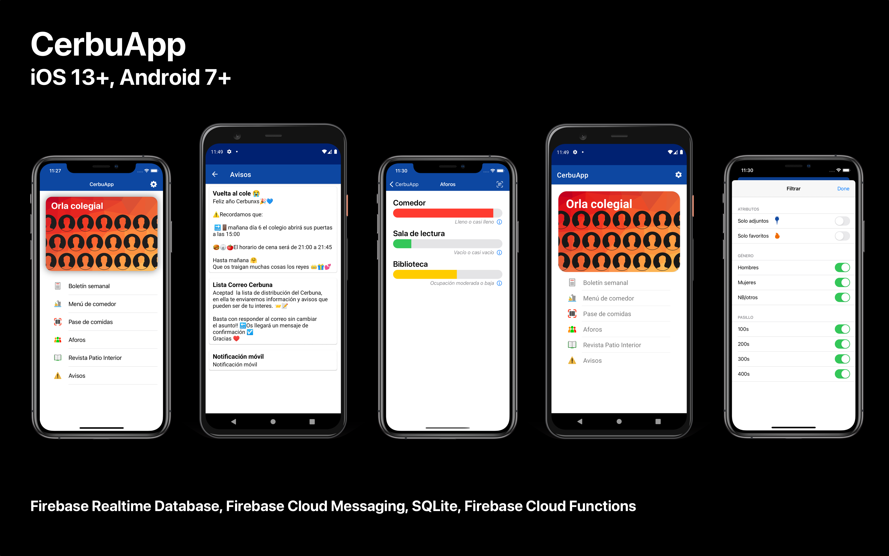

# CerbuApp

Aplicación para los colegiales en el CMU Pedro Cerbuna. Orla colegial con nombre, foto y carrera de todos los colegiales (basada en SQL), boletín semanal, control de aforos (con Firebase Realtime Database y Firebase Cloud Functions) vía lectura de códigos QR y sección de avisos importantes (con Firebase Cloud Messaging).

## Compatibilidad
Funciona en iOS 13.0 en adelante (solo iPhone) y Android 7.0 en adelante.
